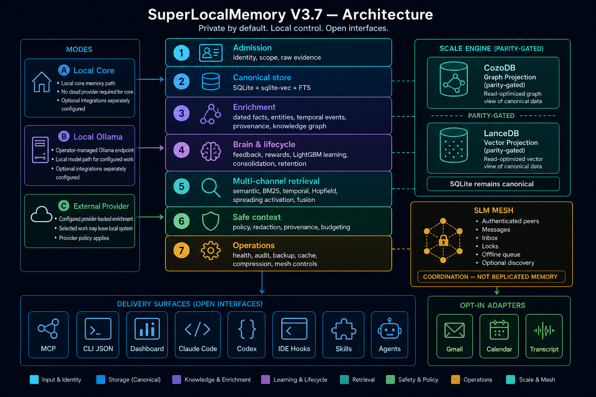

<p align="center">
  
</p>

<h1 align="center">SuperLocalMemory V3.7</h1>
<p align="center"><strong>Cache. Compress. Remember. Three surfaces — proxy, MCP tools, or skill. Every setup covered.</strong><br/>
<em>Local-first agent memory with explicit operating modes, auditable retrieval, and optional Optimize tools.</em></p>
<p align="center"><code>v3.7.0</code> — <strong>Release package; registry publication gate pending.</strong><br/>
Proxy: <code>slm wrap claude</code> &nbsp;·&nbsp; MCP: add <code>slm_compress</code> to your config &nbsp;·&nbsp; Skill: zero-config</p>
<p align="center"><strong>3 public research preprints</strong> (arXiv + Zenodo archives) · <a href="https://arxiv.org/abs/2603.02240">arXiv:2603.02240</a> · <a href="https://arxiv.org/abs/2603.14588">arXiv:2603.14588</a> · <a href="https://arxiv.org/abs/2604.04514">arXiv:2604.04514</a></p>

<p align="center">
  <a href="https://arxiv.org/abs/2603.14588"></a>
  <a href="#three-surfaces-proxy--mcp-tools--skill"></a>
  <a href="https://pypi.org/project/superlocalmemory/"></a>
  <a href="https://www.npmjs.com/package/superlocalmemory"></a>
  <a href="https://www.gnu.org/licenses/agpl-3.0"></a>
  <a href="#privacy-controls-and-operating-modes"></a>
  <a href="https://superlocalmemory.com"></a>
  <a href="#dual-interface-mcp--cli"></a>
  <a href="#dual-interface-mcp--cli"></a>
  <a href="#multilingual-embedding-support"></a>
</p>

---

## Why SuperLocalMemory?

Agent-memory systems make different storage, model-provider, and deployment trade-offs. SuperLocalMemory starts with a local runtime and makes provider-backed enrichment, cloud backup, connectors, and proxy use explicit choices.

SuperLocalMemory V3 combines conventional dense and lexical retrieval with graph, temporal, associative, and Fisher-informed scoring. The default local runtime does not require Docker, a separately operated graph database, or an API key.

**Published benchmark evidence carried into V3.7:** the architecture evaluated
in the V3 paper remains the foundation of this release. The figures below keep
their original LoCoMo protocol, answer-construction, model, and sample scope;
they are not a claim of a newly rerun 3.7 package benchmark.

### How SLM fits beside other memory systems

Different products solve different boundaries. SLM is for developers who want
one local-first operating control plane—not only an SDK, managed context API,
or agent runtime. It combines dated evidence, graph-aware retrieval, cache and
compression controls, trusted-peer Mesh, and MCP/CLI/hooks/dashboard/IDE
surfaces in one install.

| If your primary need is… | Product boundary to evaluate |
|---|---|
| Local-first agent memory plus operations, optimization, and IDE-agent surfaces | **SuperLocalMemory** — Mode A local core; Modes B/C by explicit choice. |
| A memory SDK, self-hosted server, or managed platform | [Mem0](https://github.com/mem0ai/mem0) |
| A temporal context-graph service or graph engine | [Zep / Graphiti](https://github.com/getzep/graphiti) |
| A stateful agent runtime with memory blocks and archival memory | [Letta](https://docs.letta.com/guides/core-concepts/memory/context-hierarchy) |
| LangGraph-native memory primitives and managers | [LangMem](https://github.com/langchain-ai/langmem) |
| A context API/app with profiles, connectors, and RAG | [Supermemory](https://github.com/supermemoryai/supermemory) |
| User profiles and event-timeline memory | [Memobase](https://github.com/memodb-io/memobase) |

See the [source-linked market comparison](https://superlocalmemory.com/comparison)
for current primary sources and protocol-scoped benchmark evidence. A LoCoMo
percentage is comparable only when the dataset scope, answer model, judge,
retrieval stack, and release artifact match.

### The V3.7 capability architecture

SuperLocalMemory is one local control plane for persistent agent context. It is
not just a vector store: the same runtime can accept evidence, build and govern
memory, retrieve bounded evidence for an agent, and expose cache, compression,
and peer-coordination controls through a CLI, MCP, dashboard, and supported
IDE integrations.



*Architecture boundary: SQLite + sqlite-vec remain canonical; CozoDB and
LanceDB are parity-gated projections; Mesh coordinates trusted peers rather
than replicating a distributed memory database; connectors are opt-in.*

```text
 IDEs, agents, scripts, connectors, and humans
             │  CLI · MCP (HTTP/stdio) · hooks · dashboard
             ▼
 ┌────────────────────────── SLM CONTROL PLANE ──────────────────────────┐
 │  1. Admission       identity, scope, idempotency, raw evidence         │
 │  2. Queryable core  SQLite facts + FTS durable receipt                  │
 │  3. Enrichment      facts, entities, scenes, time, provenance, graph   │
 │  4. Memory brain    feedback, patterns, rewards, consolidation          │
 │  5. Retrieval       semantic · BM25 · temporal · Hopfield · activation │
 │  6. Context safety  policy, trust, provenance, redaction, budgets      │
 │  7. Operations      lifecycle, audit, cache/compress, mesh, backups    │
 └───────────────────────────────────────────────────────────────────────┘
             │
             ▼
 SQLite + sqlite-vec canonical store  ──► optional graph/vector projections
```

The seven stages are an execution model, not a promise that every optional
enricher or retrieval channel runs for every request. The receipt, trace, and
health surfaces expose the stages actually completed by the installed runtime.

| Capability | What ships today | Operator boundary |
|---|---|---|
| **Memory types and lifecycle** | Atomic facts, episodic scenes, temporal events, canonical entities, profiles/scopes, consolidation, forgetting and retention controls | Lifecycle policies and retention decisions remain operator-configured. |
| **Ingestion** | Durable raw-to-complete operation state, fact extraction, entity resolution, graph/temporal/provenance derivations, and replay-safe identity | `--sync` waits for declared stages; dependencies and mode determine which enrichers are available. |
| **Retrieval and recall** | Semantic, lexical, temporal, Hopfield and spreading-activation candidate channels; RRF fusion, optional reranking and graph score enhancement | Healthy channels participate; response provenance states the evidence used. |
| **Brain and learning** | Behavioral patterns, feedback/outcome records, rewards, consolidation, LightGBM-related ranking components, soft prompts, and guarded skill-evolution workflows | Learning is evidence-driven; it does not claim autonomous correctness or guaranteed improvement. |
| **Knowledge graph and entities** | Canonical entities, aliases, entity profiles, graph edges, scenes, timelines, explorer and graph APIs | Stored/derived graph data is evidence, not an instruction authority. |
| **Scale Engine** | SQLite + sqlite-vec are canonical. CozoDB graph and LanceDB vector projections are packaged and managed with prepare → verify → promote → rollback | Promotion is explicit and parity-gated; do not advertise an unverified projection as the source of truth. |
| **Optimize** | Exact cache, tagged invalidation, safe compression, opt-in aggressive prose compression, CCR originals, proxy/MCP/skill surfaces | Only proxy intercepts a primary provider turn. MCP/skill cache results explicitly routed through SLM. |
| **Mesh** | Authenticated peer messages, inbox/outbox, locks, offline queue, optional discovery and mesh MCP tools | Mesh is coordination, not automatic replicated memory or conflict resolution. |
| **Governance and operations** | Provenance, audit/retention/policy surfaces, export/erasure controls, diagnostics, health, backups and daemon lifecycle | These are engineering controls, not a legal certification. |
| **Integrations** | CLI, Python SDK, MCP HTTP/stdio, Claude plugin, Codex add-on, supported IDE configurations, Gmail/Calendar/transcript adapters | Hooks, IDE edits, connectors, and networked adapters require explicit operator activation. |

### What the dashboard exposes

`slm dashboard` opens a local operational view of the same control plane:

| Workspace | Use it to inspect or control |
|---|---|
| Dashboard and Health | daemon identity, storage/runtime health, diagnostics and recent activity |
| Brain | consolidation, behavioral patterns, outcomes/rewards, learning state and soft prompts |
| Knowledge Graph and Memories | graph neighborhoods, entities, scenes, temporal evidence, memory inspection and mutation |
| Operations | ingestion-operation state, traces, maintenance and lifecycle work |
| Entity Explorer and Skill Evolution | compiled entity summaries/timelines; opt-in skill lineage, budgets and verification outcomes |
| Mesh Peers | configured peers, inbox/outbox, pending coordination and locks |
| Settings and Optimize | mode/provider/configuration; cache, compression and savings telemetry |

Dashboard visibility is not a substitute for runtime proof: use `slm doctor`,
`slm health`, `slm trace`, and the relevant CLI/MCP operation to validate a
deployment.

### Watch the product walkthrough

[](https://www.youtube.com/watch?v=PMWW_ypsL60)

**[Watch the SuperLocalMemory demo on YouTube](https://www.youtube.com/watch?v=PMWW_ypsL60)** — a five-minute walkthrough of installation, setup, recall, cache, and compression. The video shows a product walkthrough; use the commands and release notes in this README as the current release contract.

### Published LoCoMo evidence carried into V3.7

The V3 paper evaluates the architecture carried into V3.7. Every figure below
is protocol-scoped, so a reader can distinguish local retrieval, answer
construction, and cloud-assisted evaluation rather than treating unlike runs as
one score.

| Published configuration | LoCoMo aggregate | Protocol scope | What the result establishes |
|---|---:|---|---|
| **Mode A Raw** | **60.4%** | 10 conversations; 1,276 scored questions; local embeddings, local retrieval, and zero-LLM answer construction | End-to-end local answer construction under the published V3 protocol. |
| **Mode A Retrieval** | **74.8%** | 10 conversations; 1,276 scored questions; local retrieval, then GPT-4.1-mini answer synthesis | Retrieval evidence: local retrieval contributes the evidence, while the disclosed external model constructs the final answer. |
| **Mode C** | **87.7%** | Conv-30 only; 81 scored questions; text-embedding-3-large plus GPT-4.1-mini answer generation and judge | Cloud-assisted configuration on one fully disclosed conversation; not a full-dataset result. |

Published category results: Mode A Retrieval scored **72.0%** single-hop,
**70.3%** multi-hop, **80.0%** temporal, and **85.0%** open-domain. Mode C
scored **64.0%** single-hop, **100.0%** multi-hop, and **86.0%** open-domain
on its 81-question Conv-30 scope (no temporal category was reported for that
run). Across six LoCoMo conversations, the paper reports **71.7%** with the
information-geometric layers versus **58.9%** without them: **+12.7pp**.

See [arXiv:2603.14588](https://arxiv.org/abs/2603.14588) and the [official
LoCoMo paper](https://arxiv.org/abs/2402.17753) for the full protocol,
ablation table, and limitations. These are published V3 architecture results
carried into V3.7—not a substitute for a newly rerun release-artifact
benchmark.

---

## Quick Start

```bash
# Primary path 1 — npm global CLI (Node 18+)
# Creates a package-owned virtual environment. It does not modify system Python.
npm install -g superlocalmemory
slm setup       # Choose mode (A/B/C)
slm doctor      # Verify everything is working
```

```bash
# Primary path 2 — Python CLI + SDK in an activated virtual environment
python3 -m venv .venv
source .venv/bin/activate  # Windows PowerShell: .venv\Scripts\Activate.ps1
python -m pip install superlocalmemory
slm setup
slm doctor
```

```bash
# First use
slm remember "Alice works at Google as a Staff Engineer" --json
slm recall "What does Alice do?"
slm status
```

The default daemon write commits raw evidence plus a relational/FTS projection
and returns a durable receipt in `queryable` state. Enrichment then advances the
same operation through `enriching` to `complete`, or records a retryable
`failed` state. Use `slm remember "..." --sync` when the caller must wait for
all declared derivation and projector stages. JSON output includes the opaque
`operation_id`, current `materialization_state`, and fact IDs.

```bash
# Wrap your agent — starts proxy + sets environment + launches agent
slm wrap claude
# Your first repeat prompt → CACHE HIT → $0.00
# See savings: slm optimize savings --since 1
```

**Upgrading:** use the owner of the installation: `npm update -g superlocalmemory`
or, while the Python virtual environment is active,
`python -m pip install --upgrade superlocalmemory`. Then run
`slm restart && slm doctor`. Repository-clone users use the matching `upgrade`
action in `scripts/install.sh` or `scripts/install.ps1`. Installers never move
or delete memory data.

---

## Three Pillars

### Memory

<a id="dual-interface-mcp--cli"></a>

Current recall has five candidate producers—dense semantic, BM25 lexical,
temporal, Hopfield associative, and spreading activation—followed by fusion,
optional reranking, and entity-graph score enhancement. The entity graph does
not create an independent candidate in the current implementation. Core memory
is SQLite-backed. SQLite and sqlite-vec remain the canonical source of truth.
The packaged Scale Engine can maintain CozoDB graph and LanceDB vector
projections, and it remains outside active retrieval paths until
`slm db scale prepare`, `verify`, and `promote` prove parity against the
canonical store. This makes the capability available on a fresh installation
without silently migrating an existing user's data.

Canonical ingestion is a durable state machine: `raw → queryable → enriching →
complete`, with `failed` retaining raw evidence, error details, attempt count,
and retry timing. SQLite relational facts and FTS are the queryable checkpoint;
optional ANN/vector projectors are verified before `complete` is granted.

Recalled text is treated as untrusted evidence. Hooks, MCP `session_init`, CLI
session context, and chat use one bounded renderer that redacts recognized
secrets, neutralizes forged boundary markers, and attaches provenance. Trusted
IDE instruction files contain only the static SLM protocol; fresh memory is
retrieved at runtime rather than copied into those files.

**Score Contract v2:** `relevance_score` is query-relative relevance;
`ranking_score` is internal ranking utility; `memory_confidence` belongs to the
stored assertion; and `trust_score` is an evidence-policy signal. Legacy
`score` and `confidence` remain aliases for one compatibility release. V3.7 is
explicitly uncalibrated: `calibration_status` is `uncalibrated` and
`answer_confidence` is `null`. See
[the retrieval score contract](docs/retrieval-score-contract.md).

The retrieval/lifecycle implementation includes three mathematical layers that
can run without a cloud LLM:

1. **Fisher-informed scoring** — dense candidate generation uses cosine similarity; Fisher-derived terms can modify later scoring when their state is available.
2. **Sheaf Cohomology for Consistency** — algebraic topology detects contradictions via coboundary norms on the knowledge graph.
3. **Riemannian Langevin Lifecycle** — memory positions evolve on the Poincare ball; neglected memories self-archive, no hardcoded thresholds.

Auto-capture hooks are installed explicitly with `slm hooks install` (Claude
Code) or `slm hooks install --agent codex` (Codex). Hook latency and capture
quality must be evaluated for the target client and workload; V3.7 publishes
no universal p99 claim.

**Multi-scope memory (v3.6.15, opt-in):** keep memories `personal` (default), `shared` with named profiles, or `global` across the machine. Off by default — recall only ever returns your own facts until you turn sharing on, per call or in config. See **[docs/shared-memory.md](docs/shared-memory.md)**.

<a id="multilingual-embedding-support"></a>

**Multilingual models:** configure an OpenAI-compatible embedding endpoint such as Ollama, vLLM, LiteLLM, `bge-m3`, `multilingual-e5`, or `Qwen3-Embedding`. Language coverage and retrieval quality depend on the selected model and should be evaluated for the deployment corpus.

### Cache + Compress

<a id="three-surfaces-proxy--mcp-tools--skill"></a>

One engine, three ways in — choose the surface that fits your setup:

| Surface | How you use it | Requires proxy? | Window effect | Cache scope |
|---------|---------------|:---------------:|:-------------:|-------------|
| **A — Proxy** | `slm wrap claude` or `ANTHROPIC_BASE_URL=http://127.0.0.1:8765` | **Yes** | Shrinks | Full-turn cache — every call |
| **B — MCP tools** | Add 5 tools to MCP config; call `slm_compress`, `slm_cache_set/get` | **No** | **Preserved (1M)** | Results you explicitly route through SLM |
| **C — Skill** | Copy `skills/slm-optimize/SKILL.md` → `~/.claude/skills/` | **No** | **Preserved (1M)** | Auto-applied by the agent per skill rules |

**The hard constraint:** The primary Claude conversation turn cannot be cached without a proxy. The MCP/skill path caches results you explicitly route through SLM (tool outputs, file reads, sub-model calls) — without a proxy the main conversation turn is not intercepted.

**How to choose:**
- Metered API (pay-per-token), want every call cached → **Proxy (A)**
- Pro/Max/Team subscription or any plan where you won't run a proxy → **MCP tools (B)** or **Skill (C)**
- Zero configuration → **Skill (C)**: install once, auto-compresses CLAUDE.md and large outputs
- Agent-controlled caching of repeated file reads → **MCP tools (B)**

**Cache:** exact-match SQLite lookup is the stable cache path. Semantic cache
controls are experimental until release-linked precision, invalidation, and
tenant-isolation evidence exists. A cache hit can avoid a provider request, but
actual cost and latency savings depend on the intercepted surface and provider.

**Compress:** safe mode uses conservative normalization and preserves JSON and code; measured reduction varies by content and can be zero. Aggressive prose compression is opt-in and lossy. CCR can retain an original for later byte-exact retrieval when reversible storage is enabled.

**Savings dashboard:** `slm optimize savings --since 7` — live USD/INR/tokens saved. Hot-reload config, fail-open.

### Mesh

<a id="multi-machine-mesh-coordination"></a>

Mesh provides authenticated coordination messages between configured peers, with an offline queue and optional mDNS discovery (`SLM_MESH_DISCOVERY=on`). It is not a replicated or conflict-resolving distributed-memory database.

```bash
# Machine A (broker)
export SLM_MESH_HOST=192.168.1.100
export SLM_MESH_SHARED_SECRET=my-secret-key
slm init

# Machine B (client)
export SLM_MESH_PEER_URL=http://192.168.1.100:8765
export SLM_MESH_SHARED_SECRET=my-secret-key
slm init
```

8 mesh MCP tools: `mesh_peers`, `mesh_send`, `mesh_broadcast`, `mesh_project`, `mesh_inbox`, `mesh_pending`, `mesh_state`, `mesh_lock`.

Full docs: [docs/multi-machine.md](docs/multi-machine.md) · [docs/distributed-deployment.md](docs/distributed-deployment.md)

---

## Install Paths

| Path | Command | When |
|:-----|:--------|:-----|
| **npm global CLI** (primary) | `npm install -g superlocalmemory` | Node 18+; package-owned virtual environment; system Python is not modified; run `slm setup` explicitly afterward |
| **Python CLI + SDK** (primary) | Activate a Python virtual environment, then `python -m pip install superlocalmemory` | Python 3.11+; the `slm` CLI and importable SDK stay inside that environment |
| **Repository clone — macOS/Linux** | `./scripts/install.sh install` | Research/contributor path; delegates to an existing uv or pipx installation |
| **Repository clone — Windows** | `.\scripts\install.ps1 -Action Install` | Research/contributor path; delegates to an existing uv or pipx installation |
| **Claude Code Plugin** (WP-06) | `/plugin marketplace add qualixar/superlocalmemory` then `/plugin install superlocalmemory@qualixar` | Self-bootstraps venv, isolated SLM_DATA_DIR, additive — 14-tool core. Ships the skills/agents/hooks/commands |
| **Portable / IDE connect** (WP-08) | `slm connect <ide> [--here]` | Wire any IDE without reinstalling; `slm connect claude-code` → plugin pointer |

After any install path: `slm setup` → `slm doctor` → `slm warmup` (optional, pre-downloads ~500MB embedding model).

| Component | Size | When |
|:----------|:-----|:-----|
| Core libraries (numpy, scipy, networkx) | ~50MB | During install |
| Dashboard & MCP server (fastapi, uvicorn) | ~20MB | During install |
| Learning engine (lightgbm) | ~10MB | During install |
| Search engine (sentence-transformers, torch) | ~200MB | During install |
| Embedding model (nomic-embed-text-v1.5, 768d) | ~500MB | First use or `slm warmup` |
| **Mode B** requires [Ollama](https://ollama.com) + a model (`ollama pull llama3.2`) | ~2GB | Manual |

---

## MCP + Profiles

SLM supports two MCP transports:

**HTTP (recommended, v3.6.7+):**
```json
{ "mcpServers": { "superlocalmemory": { "type": "http", "url": "http://127.0.0.1:8765/mcp/" } } }
```
Or: `claude mcp add --transport http superlocalmemory http://127.0.0.1:8765/mcp/`

**stdio (universal fallback):**
```json
{ "mcpServers": { "superlocalmemory": { "command": "slm", "args": ["mcp"] } } }
```

### MCP Profiles (WP-01)

Control tool surface via `SLM_MCP_PROFILE`:

| Profile | Tools | Use case |
|:--------|:-----:|:---------|
| `core` | 14 | Memory, session, and optimize core |
| `code` | 20 | Core + code-graph tools |
| `mesh` | 8 | Mesh-only — multi-machine coordination |
| `full` | 38 | Memory + optimize + evolution + mesh |
| `power` | 50 | Full + administration, lifecycle, and diagnostics |
| `whole` | all registered | Every registered MCP tool |

**Precedence:** `ALL` > `TOOLS` > `PROFILE` > `default`

```bash
export SLM_MCP_PROFILE=full   # or core / code / mesh / power / whole
slm mcp
```

For a predictable small surface, set `core` explicitly. Leaving the variable
unset retains the compatibility default, whose mesh tools follow the local
mesh setting. The former count-suffixed names (`core14`, `code20`, `mesh8`,
`full38`, `power50`, `whole81`) remain temporary aliases and emit a migration
warning. Unknown names stop startup instead of silently selecting another tool
set.

Per-IDE configs available for Claude Code, Cursor, Windsurf, VS Code Copilot, Continue, Gemini CLI, JetBrains, Zed, and more (15 configs in `ide/configs/`). See [docs/ide-setup.md](docs/ide-setup.md).

---

## Claude Code Plugin

Install directly in Claude Code — no system-level npm/pip needed. This is how you
get the **skills, agents, hooks, commands, and rules** (the MCP server is
bootstrapped automatically). It is a two-step flow — add the marketplace once,
then install:

```bash
# 1. Add the Qualixar marketplace (one-time — the repo IS the marketplace)
/plugin marketplace add qualixar/superlocalmemory

# 2. Install the plugin
/plugin install superlocalmemory@qualixar
```

- Self-bootstraps a Python venv, installs all deps in an isolated `SLM_DATA_DIR`
- Registers the 14-tool core MCP surface (`core14` profile by default)
- Ships the SLM skills / agents / hooks / commands / rules
- Additive — does not replace an existing SLM install
- `slm connect claude-code` detects an existing plugin install and links them

> **Plugin vs Python/npm:** `python -m pip install superlocalmemory` inside an
> activated virtual environment, or `npm i -g superlocalmemory`,
> give you the `slm` CLI + the MCP server (the *tools*). The **skills/agents/hooks/
> commands** come only through the plugin above. Use the plugin for Claude Code; use
> pip/npm for the CLI or other IDEs.

To update later: `/plugin marketplace update qualixar` then `/plugin install superlocalmemory@qualixar`.

## Codex add-on

For Codex, install the SLM-owned skills, two focused subagents, and four
lifecycle hooks explicitly:

```bash
slm codex install
```

This adds only SLM-owned files under `~/.agents/skills`, `~/.codex/agents`, and
`~/.codex/hooks.json`; it does not replace another agent's hooks or rewrite
`~/.codex/config.toml`. Codex requires review and trust for new command hooks:
open `/hooks` after installation. MCP wiring remains a separate explicit step:

```bash
slm connect codex
```

`slm connect codex` semantically merges the `superlocalmemory` MCP server into
`~/.codex/config.toml`, preserving unrelated configuration keys and writing
atomically. TOML serializers can normalize whitespace and comments, so it is
not a byte-preserving operation; use it only when you want the MCP server
configured. Check the result with `slm codex status`; undo SLM-owned add-ons
with `slm codex remove`.

---

## Privacy controls and operating modes

<a id="privacy-controls-and-operating-modes"></a>

| Mode | What | Core memory path | Optional network behavior |
|:----:|:-----|:-----------------|:--------------------------|
| **A** | Local Guardian | Local processing | Model/dependency downloads, connectors, backup, and other enabled integrations may use the network |
| **B** | Smart Local | Local Ollama enrichment | Same optional integrations as Mode A |
| **C** | Provider-assisted | Local storage with provider calls | Query or enrichment content is sent to the configured provider |

```bash
slm mode a   # Zero-cloud (default)
slm mode b   # Local Ollama
slm mode c   # Cloud LLM
```

Mode A can run core memory operations without sending memory content to a cloud model provider. This does not disable optional connectors, cloud backup, proxy providers, dependency acquisition, or model downloads; review configuration and network policy for the deployment.

SuperLocalMemory provides local storage, export/erasure commands, provenance, policy, and audit features that can support a compliance program. The software is not a legal certification, and compliance depends on the use case, operator, configuration, and surrounding systems.

Available controls include local export and erasure commands, hash-chained audit records, provenance tracking, and ABAC policy enforcement. Verify their behavior and retention boundaries for your deployment; see [docs/compliance.md](docs/compliance.md).

---

## Advanced

| Topic | Link |
|:------|:-----|
| Full optimize docs | [docs/optimize-overview.md](docs/optimize-overview.md) · [docs/optimize-cli.md](docs/optimize-cli.md) · [docs/optimize-config.md](docs/optimize-config.md) |
| Distributed deployment | [docs/distributed-deployment.md](docs/distributed-deployment.md) |
| Multi-machine mesh | [docs/multi-machine.md](docs/multi-machine.md) |
| Auto-memory hooks | [docs/auto-memory.md](docs/auto-memory.md) |
| Architecture + math | [docs/ARCHITECTURE.md](docs/ARCHITECTURE.md) |
| Published benchmark evidence | [docs/benchmarks.md](docs/benchmarks.md) |
| CLI reference | [docs/cli-reference.md](docs/cli-reference.md) |
| MCP tools reference | [docs/mcp-tools.md](docs/mcp-tools.md) |
| Getting started | [docs/getting-started.md](docs/getting-started.md) |
| IDE setup (15 configs) | [docs/ide-setup.md](docs/ide-setup.md) |
| pi.dev integration | [docs/pi-dev-integration.md](docs/pi-dev-integration.md) |
| Skill evolution | [docs/skill-evolution.md](docs/skill-evolution.md) |
| V2 migration | [docs/migration-from-v2.md](docs/migration-from-v2.md) |
| Configuration | [docs/configuration.md](docs/configuration.md) |
| Retrieval score contract | [docs/retrieval-score-contract.md](docs/retrieval-score-contract.md) |
| Wiki | [github.com/qualixar/superlocalmemory/wiki](https://github.com/qualixar/superlocalmemory/wiki) |

**Web dashboard:**
```bash
slm dashboard    # Opens at http://localhost:8765
```
The dashboard includes Dashboard, Brain, Knowledge Graph, Memories, Health,
Operations, Entity Explorer, Skill Evolution, Mesh Peers, Settings, and
Optimize workspaces. Features are populated only when their corresponding
runtime capability is enabled and healthy.

**Release history:**

| Version | Codename | Key Features |
|---|---|---|
| **v3.6.23** | Cross-platform Patch | Windows doctor/cache stats fixes (#65), neutral SLM hook guidance (#64), pi.dev MCP docs (#31), contributor fixes for dashboard profile path resolution (#63) and tz-naive Langevin maintenance backfill (#66) |
| **v3.6.22** | Stability | backbone.py JSONDecodeError on empty HTTP 200 body (issue #62) — retries 3× then returns "" gracefully; remaining dashboard UI audit: clusters/compliance/entities r.ok guards, math-health status badge colors |
| **v3.6.21** | Dashboard Audit | Full UI audit across all 7 dashboard tabs — auth fix for mesh panel (issue #60 frontend), Quick Store endpoint, timeline endpoint, r.ok guards, SSE \r fix, event delegation for lazy tabs, optimize toggle revert |
| **v3.6.20** | Mesh Auth | Remote mesh auth fix (issue #60) — `_get_broker` now accepts Bearer + X-Mesh-Secret from non-loopback callers; config settings preservation (AIDEV-86) |
| **v3.6.17** | Community | 8 contributor PRs (observability events, marker-bounded adapter writes, daemon port discovery, anthropic `api_base`, OpenMP workers, atomic-write rehash, `_jl` sentinel, LFS pointer); dashboard-feedback fix (#53/#59); env-tunable SQLite knobs + idle backoff; remote LLM test-probe (#40) |
| **v3.6.16** | Docs | Corrected Claude Code plugin install — adds the required `/plugin marketplace add` step; clarifies plugin vs pip/npm delivery |
| **v3.6.15** | Multi-scope | **Opt-in [shared memory](docs/shared-memory.md)** (personal/shared/global, off by default), default-deny scope at every read path, recall scope-race fix, contributor PRs #42/#43/#44, fixes #46–#49 |
| **v3.6.14** | Plugin-native | Claude Code Plugin (WP-06), MCP profiles (WP-01), IDE connect (WP-08), asset consolidation, UI polish (WP-12) |
| **v3.6.x** | Optimize Everywhere / Distributed-ready | Three surfaces (proxy/MCP/skill), `SLM_REMOTE=1` LAN mode, remote dashboard, custom LLM endpoints |
| **v3.5.0** | Historical scale work | Early CozoDB/LanceDB projection paths, retrieval additions, Core Memory Block, context injection v2, score normalization |
| **v3.4.x** | Scale-Ready (foundation) | Tiered storage, graph pruning, Hopfield channel, LightGBM ranking, mDNS mesh discovery |
| **v3.3.x** | Foundation | BM25Plus, Fisher-Rao, sqlite-vec, RRF fusion, cross-encoder rerank. 3 published papers |

---

## Research Papers

SuperLocalMemory is backed by three published research papers (arXiv preprints + Zenodo DOIs). These are preprints — not conference-accepted or journal-published yet.

### Paper 3: The Living Brain (V3.3)
> **SuperLocalMemory V3.3: The Living Brain — Biologically-Inspired Forgetting, Cognitive Quantization, and Multi-Channel Retrieval for Zero-LLM Agent Memory Systems**
> Varun Pratap Bhardwaj (2026)
> [arXiv:2604.04514](https://arxiv.org/abs/2604.04514) · [Zenodo DOI: 10.5281/zenodo.19435120](https://zenodo.org/records/19435120)

### Paper 2: Information-Geometric Foundations (V3)
> **SuperLocalMemory V3: Information-Geometric Foundations for Zero-LLM Enterprise Agent Memory**
> Varun Pratap Bhardwaj (2026)
> [arXiv:2603.14588](https://arxiv.org/abs/2603.14588) · [Zenodo DOI: 10.5281/zenodo.19038659](https://zenodo.org/records/19038659)

### Paper 1: Trust & Behavioral Foundations (V2)
> **SuperLocalMemory: A Structured Local Memory Architecture for Persistent AI Agent Context**
> Varun Pratap Bhardwaj (2026)
> [arXiv:2603.02240](https://arxiv.org/abs/2603.02240) · [Zenodo DOI: 10.5281/zenodo.18709670](https://zenodo.org/records/18709670)

### Cite This Work

```bibtex
@article{bhardwaj2026slmv33,
  title={SuperLocalMemory V3.3: The Living Brain — Biologically-Inspired
         Forgetting, Cognitive Quantization, and Multi-Channel Retrieval
         for Zero-LLM Agent Memory Systems},
  author={Bhardwaj, Varun Pratap},
  journal={arXiv preprint arXiv:2604.04514},
  year={2026},
  url={https://arxiv.org/abs/2604.04514}
}

@article{bhardwaj2026slmv3,
  title={Information-Geometric Foundations for Zero-LLM Enterprise Agent Memory},
  author={Bhardwaj, Varun Pratap},
  journal={arXiv preprint arXiv:2603.14588},
  year={2026}
}

@article{bhardwaj2026slm,
  title={A Structured Local Memory Architecture for Persistent AI Agent Context},
  author={Bhardwaj, Varun Pratap},
  journal={arXiv preprint arXiv:2603.02240},
  year={2026}
}
```

---

## Support / License / Qualixar

See [CONTRIBUTING.md](CONTRIBUTING.md) for guidelines. [Wiki](https://github.com/qualixar/superlocalmemory/wiki) for detailed documentation.

GNU Affero General Public License v3.0 (AGPL-3.0). See [LICENSE](LICENSE).

For commercial licensing (closed-source, proprietary, or hosted use), see [COMMERCIAL-LICENSE.md](COMMERCIAL-LICENSE.md) or contact varun.pratap.bhardwaj@gmail.com.

Copyright (c) 2026 Varun Pratap Bhardwaj / Qualixar.

Part of [Qualixar](https://qualixar.com) · Author: [Varun Pratap Bhardwaj](https://varunpratap.com)

### Acknowledgments

- **[Everything Claude Code (ECC)](https://github.com/affaan-m/everything-claude-code)** — SLM's skill observation patterns were inspired by ECC's continuous learning architecture. SLM supports direct ingestion of ECC observations via `slm ingest --source ecc`. We recommend ECC for Claude Code users who want the deepest learning experience alongside SLM.
- **[HKUDS/OpenSpace](https://github.com/HKUDS/OpenSpace)** — The skill evolution research in SLM draws from the EvoSkills co-evolutionary verification concepts (arXiv:2604.01687). We adopted their 3-trigger evolution system and anti-loop guard patterns.

### Qualixar AI Agent Reliability Platform

Qualixar is building the open-source infrastructure for AI agent reliability engineering. Seven products, one coherent platform:

| Product | Purpose | Install |
|---------|---------|---------|
| **[SuperLocalMemory](https://github.com/qualixar/superlocalmemory)** | Persistent memory + learning | `npm install -g superlocalmemory` |
| **[Qualixar OS](https://github.com/qualixar/qualixar-os)** | Universal agent runtime | `npx qualixar-os` |
| **[SLM Mesh](https://github.com/qualixar/slm-mesh)** | P2P coordination across sessions | `npm i slm-mesh` |
| **[SLM MCP Hub](https://github.com/qualixar/slm-mcp-hub)** | Federate 430+ MCP tools | `pip install slm-mcp-hub` |
| **[AgentAssay](https://github.com/qualixar/agentassay)** | Token-efficient agent testing | `pip install agentassay` |
| **[AgentAssert](https://github.com/qualixar/agentassert-abc)** | Behavioral contracts + drift detection | `pip install agentassert-abc` |
| **[SkillFortify](https://github.com/qualixar/skillfortify)** | Formal verification for agent skills | `pip install skillfortify` |

**Local-first architecture. Deployment-specific privacy and compliance controls.**

Start here → **[qualixar.com](https://qualixar.com)** · [All papers on Qualixar HuggingFace](https://huggingface.co/Qualixar)

---

<p align="center">
  <sub>Built with mathematical rigor. Not in the race — here to help everyone build better AI memory systems.</sub>
</p>

---

## Star This Project

If this project solves a real problem for you, **please star the repo** — it helps other developers discover Qualixar and signals that the AI agent reliability community is growing.

[](https://github.com/qualixar/superlocalmemory)

The live Star History chart is intentionally not embedded: its upstream service timed out during release validation. The link above is the stable, direct way to star and follow the repository.
