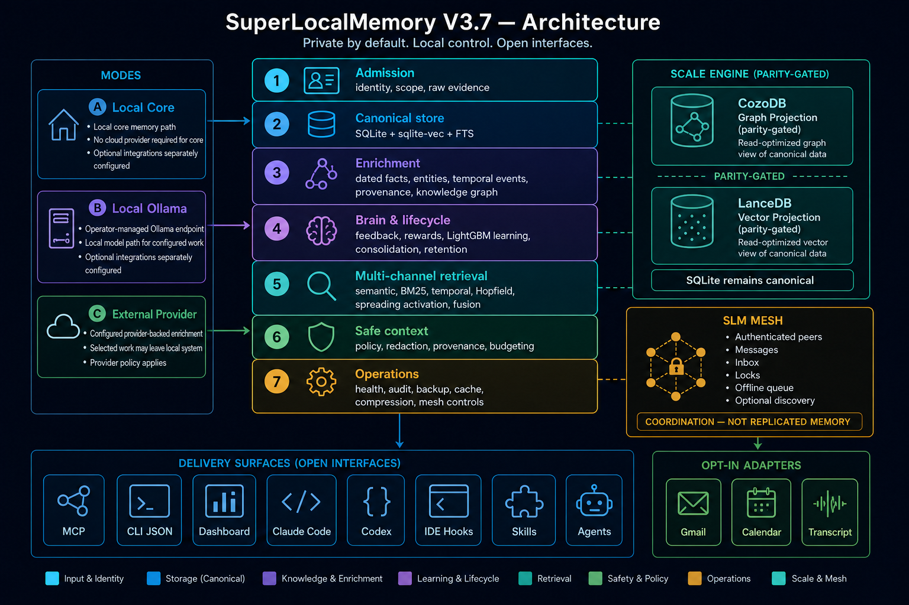

<p align="center">
  <picture>
    <source media="(prefers-color-scheme: dark)" srcset="assets/branding/slm-wordmark-dark.svg">
    
  </picture>
</p>

<h1 align="center">SuperLocalMemory V4.1.13</h1>

<h2 align="center">Rent the LLM. Own the memory.</h2>

<p align="center"><em>Rent an LLM — but own the memory, for your company and for your industry.</em></p>

<p align="center"><strong>The governed memory layer for AI agents: local-first, auditable, and built for the compliance obligations teams now actually carry.</strong><br/>
Models are interchangeable and rented by the token. What your agents <em>remember</em> is
yours — it is your customers' data, your retention obligations, and your audit trail. SLM
keeps that layer on infrastructure you control, with multi-workspace isolation, role-based
access, and GDPR + EU AI Act governance controls built in.</p>

<p align="center"><strong>The boundary.</strong> SuperLocalMemory starts with a local runtime;
provider-backed enrichment, cloud backup, connectors, and proxy use are explicit choices.
Different products solve different boundaries. Published benchmark evidence carried into V4
comes from the published V3 research architecture; it is not a claim of a newly rerun V4 package benchmark.</p>

<p align="center"><strong>How to check that, rather than believe it.</strong> Every reliability
guarantee here is stated as a falsifiable invariant, tested under an adversarial condition with a
negative control, and shipped with the harness that regenerates the evidence:
<code>python benchmark/run_all.py --trials 200 --output-dir results/</code>. What each experiment
does <em>not</em> exercise is stated too.</p>
<p align="center"><code>v4.1.13</code> — one control plane: <strong>SLM-Mesh</strong> peer coordination · multi-scope memory (personal / shared / global) · profiles · Cache · Compress · 7-layer retrieval · code graph · Entity Explorer · skill evolution · Modes A/B/C · GDPR retention &amp; audit chain · bounded loops — across CLI, MCP, dashboard, the <strong>Claude plugin</strong>, the <strong>Codex add-on</strong>, and documented IDE integrations.<br/>
Proxy: <code>slm wrap claude</code> &nbsp;·&nbsp; MCP: add <code>slm_compress</code> to your config &nbsp;·&nbsp; Skill: zero-config</p>
<p align="center"><strong>Four public arXiv preprints</strong> · V4: <a href="https://arxiv.org/abs/2608.08253">arXiv:2608.08253</a> · companion archive: <a href="https://zenodo.org/records/21853302">Zenodo 21853302</a> (<a href="https://doi.org/10.5281/zenodo.21853302">DOI 10.5281/zenodo.21853302</a>) · prior preprints: <a href="https://arxiv.org/abs/2603.02240">2603.02240</a> · <a href="https://arxiv.org/abs/2603.14588">2603.14588</a> · <a href="https://arxiv.org/abs/2604.04514">2604.04514</a>.</p>

<p align="center">
  <a href="CHANGELOG.md"></a>
  <a href="https://arxiv.org/abs/2608.08253"></a>
  <a href="https://zenodo.org/records/21853302"></a>
  <a href="https://arxiv.org/abs/2603.14588"></a>
  <a href="#three-surfaces-proxy--mcp-tools--skill"></a>
  <a href="https://pypi.org/project/superlocalmemory/"></a>
  <a href="https://www.npmjs.com/package/superlocalmemory"></a>
  <a href="https://www.gnu.org/licenses/agpl-3.0"></a>
  <a href="#privacy-controls-and-operating-modes"></a>
  <a href="#teams-and-enterprise-memory-v4"></a>
  <a href="https://superlocalmemory.com"></a>
  <a href="#dual-interface-mcp--cli"></a>
  <a href="#dual-interface-mcp--cli"></a>
  <a href="#multilingual-embedding-support"></a>
</p>

---

## Why SuperLocalMemory?

SuperLocalMemory is an enterprise-grade, local-first memory control plane for AI agents. Your team's agent memory lives on infrastructure you control, with per-workspace isolation, role-based access, and GDPR / EU AI Act governance controls — built for organizations, and for EU data-residency obligations where agent context must not leave your environment by default.

Agent-memory systems make different storage, model-provider, and deployment trade-offs. SuperLocalMemory starts with a local runtime and makes provider-backed enrichment, cloud backup, connectors, and proxy use explicit choices.

Different products solve different boundaries. The published LoCoMo benchmark evidence in this README is protocol-scoped evidence from the published V3 research architecture; it is carried forward for continuity and is not a claim of a newly rerun V4 package benchmark.

SuperLocalMemory V4 combines conventional dense and lexical retrieval with graph, temporal, associative, and statistical relevance scoring in a **7-layer** control plane (admission → queryable core → enrichment → brain → multi-channel retrieval → context safety → operations). The default local runtime does not require Docker, a separately operated graph database, or an API key.

**Memory with a sense of time.** SLM does not only store *what* an agent learned — it records *when*. Every fact carries ingestion timing and provenance; recall runs a dedicated temporal candidate channel alongside semantic, lexical, and associative retrieval; scenes and entity timelines reconstruct sequence; and the lifecycle lets neglected memory decay and self-archive instead of growing without bound. Time is a first-class ranking and lifecycle signal rather than a timestamp column an agent never reads — which is what lets a long-lived agent reason about how its context changed, not only what it currently holds.

**What changed in this release.** See the [CHANGELOG](CHANGELOG.md) — every release is written up there, in plain language, newest first.

- **[SLM-Mesh](#slm-mesh-cross-session--cross-machine-coordination)** — authenticated cross-session and cross-machine peer coordination (messages, locks, shared state, inbox/outbox, optional discovery). Coordination only — not automatic replicated memory.
- **Multi-scope memory & profiles** — workspaces (profiles) plus `personal` / `shared` / `global` scopes; cross-profile recall is default-deny.
- **Cache & compression (context optimization)** — exact-match cache with tagged invalidation, safe compression, and opt-in reversible/aggressive paths across proxy, MCP, and skill surfaces.
- **Entity Explorer & skill evolution** — compiled entity summaries/timelines; opt-in skill lineage, budgets, and verification outcomes.
- **Modes A / B / C** — local-only (A), on-device LLM enrichment (B), provider-assisted (C). An operating mode records technical locality facts; it does **not** determine EU AI Act legal compliance (that is deployment-context assessment — see [Privacy controls](#privacy-controls-and-operating-modes)).
- **GDPR posture, retention & audit chain** — export, fail-closed cross-store erasure, retention policies, and a hash-chained audit trail. Engineering controls for compliance programs, not a legal certification.
- **7-layer retrieval/recall stack & code graph** — multi-channel candidates (semantic, BM25, temporal, Hopfield, spreading activation) plus optional code-graph tools for blast radius and review context.
- **MCP profiles** — `code` exposes **31** tools for installed coding agents; `full` **49**; `power` **61**; `whole` **94** (all registered). Also `core` (16), `mesh` (8), and the unrestricted default surface (49 with mesh enabled).
- **Governed write path & verifiable transactions** — admission + policy control, a per-owner obligation ledger, and a hash-sealed completion manifest with a reconciler that redrives unmet obligations.
- **Self-healing lifecycle & admin remediation** — stale locks cleared on restart; list/resolve stuck operations from CLI, MCP, or the dashboard.

SLM is one strand of Qualixar's work on AI reliability engineering: making agent behavior observable, bounded, and reproducible instead of best-effort.

The architecture evaluated in the V3 paper remains the foundation of this release. The figures below keep their original LoCoMo protocol, answer-construction, model, and sample scope.

### How SLM fits beside other memory systems

Different products solve different boundaries. SLM is for developers who want
one local-first operating control plane—not only an SDK, managed context API,
or agent runtime. It combines dated evidence, graph-aware retrieval, cache and
compression controls, **SLM-Mesh**, and MCP/CLI/hooks/dashboard/IDE
surfaces in one install.

| If your primary need is… | Product boundary to evaluate |
|---|---|
| Local-first agent memory plus operations, optimization, and IDE-agent surfaces | **SuperLocalMemory** — Mode A local core; Modes B/C by explicit choice. |
| A memory SDK, self-hosted server, or managed platform | [Mem0](https://github.com/mem0ai/mem0) |
| A temporal context-graph service or graph engine | [Zep / Graphiti](https://github.com/getzep/graphiti) |
| A stateful agent runtime with memory blocks and archival memory | [Letta](https://docs.letta.com/guides/core-concepts/memory/context-hierarchy) |
| LangGraph-native memory primitives and managers | [LangMem](https://github.com/langchain-ai/langmem) |
| A context API/app with profiles, connectors, and RAG | [Supermemory](https://github.com/supermemoryai/supermemory) |
| User profiles and event-timeline memory | [Memobase](https://github.com/memodb-io/memobase) |

See the [source-linked market comparison](https://superlocalmemory.com/comparison)
for current primary sources and protocol-scoped benchmark evidence. A LoCoMo
percentage is comparable only when the dataset scope, answer model, judge,
retrieval stack, and release artifact match.

### The V4 capability architecture

SuperLocalMemory is one local control plane for persistent agent context. It is
not just a vector store: the same runtime can accept evidence, build and govern
memory, retrieve bounded evidence for an agent, and expose cache, compression,
and **SLM-Mesh** peer-coordination controls through a CLI, MCP, dashboard, and supported
IDE integrations.



*Architecture boundary: SQLite + sqlite-vec remain canonical; CozoDB and
LanceDB are parity-gated projections; **SLM-Mesh** coordinates trusted peers rather
than replicating a distributed memory database; connectors are opt-in.*

**Memory boundaries:** profiles isolate workspaces by default. Every memory is
`personal`, `shared` with named profile readers, or `global`; cross-profile
recall is default-deny and must be explicitly enabled. This scoped sharing is
local authorization, not **SLM-Mesh** synchronization. See
[shared-memory.md](docs/shared-memory.md).

```text
 IDEs, agents, scripts, connectors, and humans
             │  CLI · MCP (HTTP/stdio) · hooks · dashboard
             ▼
 ┌────────────────────────── SLM CONTROL PLANE ──────────────────────────┐
 │  1. Admission       identity, scope, idempotency, raw evidence         │
 │  2. Queryable core  SQLite facts + FTS durable receipt                  │
 │  3. Enrichment      facts, entities, scenes, time, provenance, graph   │
 │  4. Memory brain    feedback, patterns, rewards, consolidation          │
 │  5. Retrieval       semantic · BM25 · temporal · Hopfield · activation │
 │  6. Context safety  policy, trust, provenance, redaction, budgets      │
 │  7. Operations      lifecycle, audit, cache/compress, mesh, backups    │
 └───────────────────────────────────────────────────────────────────────┘
             │
             ▼
 SQLite + sqlite-vec canonical store  ──► optional graph/vector projections
```

The seven stages are an execution model, not a promise that every optional
enricher or retrieval channel runs for every request. The receipt, trace, and
health surfaces expose the stages actually completed by the installed runtime.

| Capability | What ships today | Operator boundary |
|---|---|---|
| **Memory types and lifecycle** | Atomic facts, episodic scenes, temporal events, canonical entities, profiles/scopes, consolidation, forgetting and retention controls | Lifecycle policies and retention decisions remain operator-configured. |
| **Memory boundaries** | Profile-isolated workspaces plus `personal`, `shared`, and `global` memory scopes | Personal is the default; shared/global recall requires explicit scope policy or per-call opt-in. |
| **Ingestion** | Durable raw-to-complete operation state, fact extraction, entity resolution, graph/temporal/provenance derivations, and replay-safe identity | `--sync` waits for declared stages; dependencies and mode determine which enrichers are available. |
| **Retrieval and recall** | Semantic, lexical, temporal, Hopfield and spreading-activation candidate channels; RRF fusion, optional reranking and graph score enhancement | Healthy channels participate; response provenance states the evidence used. |
| **Brain and learning** | Behavioral patterns, feedback/outcome records, rewards, consolidation, LightGBM-related ranking components, soft prompts, and guarded skill-evolution workflows | Learning is evidence-driven; it does not claim autonomous correctness or guaranteed improvement. |
| **Knowledge graph and entities** | Canonical entities, aliases, entity profiles, graph edges, scenes, timelines, explorer and graph APIs | Stored/derived graph data is evidence, not an instruction authority. |
| **Scale Engine** | SQLite + sqlite-vec are canonical. CozoDB graph and LanceDB vector projections are managed with prepare → verify → promote → rollback; a structurally detected pre-v3.7 projection can be explicitly adopted. | Promotion is parity-gated and crash-recoverable. Legacy adoption preserves the prior projection as a rollback backup; repeated physical edge rows normalize to one logical edge with the strongest weight. |
| **Optimize** | Exact cache, tagged invalidation, safe compression, opt-in aggressive prose compression, CCR originals, proxy/MCP/skill surfaces | Only proxy intercepts a primary provider turn. MCP/skill cache results explicitly routed through SLM. |
| **SLM-Mesh** | Authenticated peer messages, inbox/outbox, locks, offline queue, optional discovery and mesh MCP tools | SLM-Mesh is coordination, not automatic replicated memory or conflict resolution. |
| **Governance and operations** | Provenance, audit/retention/policy surfaces, export/erasure controls, diagnostics, health, backups and daemon lifecycle | These are engineering controls, not a legal certification. |
| **Integrations** | CLI, Python SDK, MCP HTTP/stdio, Claude plugin, Codex add-on, supported IDE configurations, Gmail/Calendar/transcript adapters | Hooks, IDE edits, connectors, and networked adapters require explicit operator activation. |

### What the dashboard exposes

`slm dashboard` opens a local operational view of the same control plane:

| Workspace | Use it to inspect or control |
|---|---|
| Dashboard and Health | daemon identity, storage/runtime health, diagnostics and recent activity |
| Brain | consolidation, behavioral patterns, outcomes/rewards, learning state and soft prompts |
| Knowledge Graph and Memories | graph neighborhoods, entities, scenes, temporal evidence, memory inspection and mutation |
| Operations | ingestion-operation state, traces, maintenance and lifecycle work |
| Entity Explorer and Skill Evolution | compiled entity summaries/timelines; opt-in skill lineage, budgets and verification outcomes |
| Multi-Agent Memory | per-agent write activity and attribution; memories stamped by `SLM_AGENT_ID`, agent write counts, and trust signals |
| SLM-Mesh Peers | configured peers, inbox/outbox, pending coordination and locks |
| Settings and Optimize | mode/provider/configuration; cache, compression and savings telemetry |

Dashboard visibility is not a substitute for runtime proof: use `slm doctor`,
`slm health`, `slm trace`, and the relevant CLI/MCP operation to validate a
deployment.

### Watch the product walkthrough

[](https://www.youtube.com/watch?v=PMWW_ypsL60)

**[Watch the SuperLocalMemory demo on YouTube](https://www.youtube.com/watch?v=PMWW_ypsL60)** — a five-minute walkthrough of installation, setup, recall, cache, and compression. The video shows a product walkthrough; use the commands and release notes in this README as the current release contract.

### Published LoCoMo evidence (V3 architecture, carried into V4)

The V3 paper evaluates the multi-channel architecture that V4 still runs. Every figure below
is protocol-scoped, so a reader can distinguish local retrieval, answer
construction, and cloud-assisted evaluation rather than treating unlike runs as
one score.

| Published configuration | LoCoMo aggregate | Protocol scope | What the result establishes |
|---|---:|---|---|
| **Mode A Raw** | **60.4%** | 10 conversations; 1,276 scored questions; local embeddings, local retrieval, and zero-LLM answer construction | End-to-end local answer construction under the published V3 protocol. |
| **Mode A Retrieval** | **74.8%** | 10 conversations; 1,276 scored questions; local retrieval, then GPT-4.1-mini answer synthesis | Retrieval evidence: local retrieval contributes the evidence, while the disclosed external model constructs the final answer. |
| **Mode C** | **87.7%** | Conv-30 only; 81 scored questions; text-embedding-3-large plus GPT-4.1-mini answer generation and judge | Cloud-assisted configuration on one fully disclosed conversation; not a full-dataset result. |

Published category results: Mode A Retrieval scored **72.0%** single-hop,
**70.3%** multi-hop, **80.0%** temporal, and **85.0%** open-domain. Mode C
scored **64.0%** single-hop, **100.0%** multi-hop, and **86.0%** open-domain
on its 81-question Conv-30 scope (no temporal category was reported for that
run). Across six LoCoMo conversations, the paper reports **71.7%** with the
information-geometric layers versus **58.9%** without them: **+12.7pp**.

See [arXiv:2603.14588](https://arxiv.org/abs/2603.14588) and the [official
LoCoMo paper](https://arxiv.org/abs/2402.17753) for the full protocol,
ablation table, and limitations. These are published V3 architecture results
carried into V4—not a substitute for a newly rerun release-artifact benchmark.

---

## Quick Start

```bash
# Primary path 1 — npm global CLI (Node 18+)
# Creates a package-owned virtual environment. It does not modify system Python.
npm install -g superlocalmemory
slm setup       # Choose mode (A/B/C)
slm doctor      # Verify everything is working
```

```bash
# Primary path 2 — Python CLI + SDK in an activated virtual environment
python3 -m venv .venv
source .venv/bin/activate  # Windows PowerShell: .venv\Scripts\Activate.ps1
python -m pip install superlocalmemory
slm setup
slm doctor
```

```bash
# First use
slm remember "Alice works at Google as a Staff Engineer" --json
slm recall "What does Alice do?"
slm status
```

The default daemon write commits raw evidence plus a relational/FTS projection
and returns a durable receipt in `queryable` state. Enrichment then advances the
same operation through `enriching` to `complete`, or records a retryable
`failed` state. Use `slm remember "..." --sync` when the caller must wait for
all declared derivation and projector stages. JSON output includes the opaque
`operation_id`, current `materialization_state`, and fact IDs.

```bash
# Wrap your agent — starts proxy + sets environment + launches agent
slm wrap claude
# Your first repeat prompt → CACHE HIT → $0.00
# See savings: slm optimize savings --since 1
```

**Upgrading:** use the owner of the installation: `npm update -g superlocalmemory`
or, while the Python virtual environment is active,
`python -m pip install --upgrade superlocalmemory`. Then run
`slm restart && slm doctor`. Repository-clone users use the matching `upgrade`
action in `scripts/install.sh` or `scripts/install.ps1`. Installers never move
or delete memory data.

---

## Three Pillars

### Memory

<a id="dual-interface-mcp--cli"></a>

Current recall has five candidate producers—dense semantic, BM25 lexical,
temporal, Hopfield associative, and spreading activation—followed by fusion,
optional reranking, and entity-graph score enhancement. The entity graph does
not create an independent candidate in the current implementation. Core memory
is SQLite-backed. SQLite and sqlite-vec remain the canonical source of truth.
The packaged Scale Engine can maintain CozoDB graph and LanceDB vector
projections, and it remains outside active retrieval paths until a staged
parity witness proves it matches the canonical store. New installations remain
on Local Core. During upgrade, `slm db scale status` can identify a positive
pre-v3.7 layout candidate; the operator confirms it with `slm db scale adopt`.
SLM then rebuilds from canonical SQLite, verifies it, and promotes it with a
durable recovery journal while retaining the prior directories as a rollback
backup. `adopt` reports `restart_required: true`; run `slm restart` before
checking daemon health. If proof fails, recall remains on SQLite and status
retains the rejected manifest for inspection, retires its replaceable derived
payload, and allows a corrected retry.

Canonical ingestion is a durable state machine: `raw → queryable → enriching →
complete`, with `failed` retaining raw evidence, error details, attempt count,
and retry timing. SQLite relational facts and FTS are the queryable checkpoint;
optional ANN/vector projectors are verified before `complete` is granted.

Recalled text is treated as untrusted evidence. Hooks, MCP `session_init`, CLI
session context, and chat use one bounded renderer that redacts recognized
secrets, neutralizes forged boundary markers, and attaches provenance. Trusted
IDE instruction files contain only the static SLM protocol; fresh memory is
retrieved at runtime rather than copied into those files.

**Score Contract v2:** `relevance_score` is query-relative relevance;
`ranking_score` is internal ranking utility; `memory_confidence` belongs to the
stored assertion; and `trust_score` is an evidence-policy signal. Legacy
`score` and `confidence` remain aliases for one compatibility release. It is
explicitly uncalibrated: `calibration_status` is `uncalibrated` and
`answer_confidence` is `null`. See
[the retrieval score contract](docs/retrieval-score-contract.md).

The retrieval/lifecycle implementation includes three mathematical layers that
can run without a cloud LLM:

1. **Fisher-informed scoring** — dense candidate generation uses cosine similarity; Fisher-derived terms can modify later scoring when their state is available.
2. **Sheaf Cohomology for Consistency** — algebraic topology detects contradictions via coboundary norms on the knowledge graph.
3. **Riemannian Langevin Lifecycle** — memory positions evolve continuously on the Poincare ball, and where a memory sits decides its lifecycle stage. There is no retention timer counting down against a memory: what moves it outward is being left alone, and what pulls it back is being used. The stage boundaries themselves are fixed radii.

Auto-capture hooks are installed explicitly with `slm hooks install` (Claude
Code) or `slm hooks install --agent codex` (Codex). Hook latency and capture
quality must be evaluated for the target client and workload; SLM publishes no universal p99 claim.

**Multi-scope memory (opt-in):** keep memories `personal` (default), `shared` with named profiles, or `global` across the machine. Off by default — recall only ever returns your own facts until you turn sharing on, per call or in config. See **[docs/shared-memory.md](docs/shared-memory.md)**.

<a id="multilingual-embedding-support"></a>

**Multilingual models:** configure an OpenAI-compatible embedding endpoint such as Ollama, vLLM, LiteLLM, `bge-m3`, `multilingual-e5`, or `Qwen3-Embedding`. Language coverage and retrieval quality depend on the selected model and should be evaluated for the deployment corpus.

### Cache + Compress

<a id="three-surfaces-proxy--mcp-tools--skill"></a>

One engine, three ways in — choose the surface that fits your setup:

| Surface | How you use it | Requires proxy? | Window effect | Cache scope |
|---------|---------------|:---------------:|:-------------:|-------------|
| **A — Proxy** | `slm wrap claude` or `ANTHROPIC_BASE_URL=http://127.0.0.1:8765` | **Yes** | Shrinks | Full-turn cache — every call |
| **B — MCP tools** | Add 5 tools to MCP config; call `slm_compress`, `slm_cache_set/get` | **No** | **Preserved (1M)** | Results you explicitly route through SLM |
| **C — Skill** | Copy `skills/slm-optimize/SKILL.md` → `~/.claude/skills/` | **No** | **Preserved (1M)** | Auto-applied by the agent per skill rules |

**The hard constraint:** The primary Claude conversation turn cannot be cached without a proxy. The MCP/skill path caches results you explicitly route through SLM (tool outputs, file reads, sub-model calls) — without a proxy the main conversation turn is not intercepted.

**How to choose:**
- Metered API (pay-per-token), want every call cached → **Proxy (A)**
- Pro/Max/Team subscription or any plan where you won't run a proxy → **MCP tools (B)** or **Skill (C)**
- Zero configuration → **Skill (C)**: install once, auto-compresses CLAUDE.md and large outputs
- Agent-controlled caching of repeated file reads → **MCP tools (B)**

**Cache:** exact-match SQLite lookup is the stable cache path. Semantic cache
controls are experimental until release-linked precision, invalidation, and
tenant-isolation evidence exists. A cache hit can avoid a provider request, but
actual cost and latency savings depend on the intercepted surface and provider.

**Compress:** safe mode uses conservative normalization and preserves JSON and code; measured reduction varies by content and can be zero. Aggressive prose compression is opt-in and lossy. CCR can retain an original for later byte-exact retrieval when reversible storage is enabled.

**Savings dashboard:** `slm optimize savings --since 7` — live USD/INR/tokens saved. Hot-reload config, fail-open.

### SLM-Mesh (cross-session / cross-machine coordination)

<a id="multi-machine-mesh-coordination"></a>
<a id="slm-mesh-cross-session--cross-machine-coordination"></a>

**SLM-Mesh** is the V4 peer-coordination plane: authenticated messages, locks, shared lightweight state, inbox/outbox, and an offline queue between configured peers (same machine sessions or cross-machine). Optional mDNS discovery (`SLM_MESH_DISCOVERY=on`). It is **not** a replicated or conflict-resolving distributed-memory database — multi-scope memory sharing is a separate local-authorization feature.

```bash
# Machine A (broker)
export SLM_MESH_HOST=192.168.1.100
export SLM_MESH_SHARED_SECRET=my-secret-key
slm init

# Machine B (client)
export SLM_MESH_PEER_URL=http://192.168.1.100:8765
export SLM_MESH_SHARED_SECRET=my-secret-key
slm init
```

Eight **SLM-Mesh** MCP tools: `mesh_summary`, `mesh_peers`, `mesh_send`, `mesh_inbox`, `mesh_state`, `mesh_lock`, `mesh_events`, `mesh_status`.

Full docs: [docs/multi-machine.md](docs/multi-machine.md) · [docs/distributed-deployment.md](docs/distributed-deployment.md)

---

## Install Paths

> **V4 platform support:** Apple Silicon macOS, 64-bit Windows, and 64-bit Linux. Intel Mac and 32-bit Windows are not supported by the patched `cryptography` 50 runtime.

| Path | Command | When |
|:-----|:--------|:-----|
| **npm global CLI** (primary) | `npm install -g superlocalmemory` | Node 18+; package-owned virtual environment; system Python is not modified; run `slm setup` explicitly afterward |
| **Python CLI + SDK** (primary) | Activate a Python virtual environment, then `python -m pip install superlocalmemory` | Python 3.11+; the `slm` CLI and importable SDK stay inside that environment |
| **Repository clone — macOS/Linux** | `./scripts/install.sh install` | Research/contributor path; delegates to an existing uv or pipx installation |
| **Repository clone — Windows** | `.\scripts\install.ps1 -Action Install` | Research/contributor path; delegates to an existing uv or pipx installation |
| **Claude Code Plugin** | `/plugin marketplace add qualixar/superlocalmemory` then `/plugin install superlocalmemory@qualixar` | Self-bootstraps venv, isolated SLM_DATA_DIR, additive — 34-tool code profile. Ships the skills/agents/hooks/commands |
| **Portable / IDE connect** | `slm connect <ide> [--here]` | Wire any IDE without reinstalling; `slm connect claude-code` → plugin pointer |

After any install path: `slm setup` → `slm doctor` → `slm warmup` (optional, pre-downloads ~500MB embedding model).

### Upgrading an existing installation

An npm, pip, or repository update upgrades the SLM runtime; it does not silently
rewrite your IDE configuration, hooks, or plugin state. Review the existing
integrations first:

```bash
slm upgrade-hosts
```

Then explicitly apply the hosts you approve, for example
`slm upgrade-hosts --host codex --apply`, or use
`slm upgrade-hosts --all-detected --apply` after reviewing the preview. See
[Host Integration Upgrades](docs/host-upgrades.md) for the full safety contract
and the Claude Code plugin update path.

| Component | Size | When |
|:----------|:-----|:-----|
| Core libraries (numpy, scipy, networkx) | ~50MB | During install |
| Dashboard & MCP server (fastapi, uvicorn) | ~20MB | During install |
| Learning engine (lightgbm) | ~10MB | During install |
| Search engine (sentence-transformers, torch) | ~200MB | During install |
| Embedding model (nomic-embed-text-v1.5, 768d) | ~500MB | First use or `slm warmup` |
| **Mode B** requires [Ollama](https://ollama.com) + a model (`ollama pull llama3.2`) | ~2GB | Manual |

---

## MCP + Profiles

SLM supports two MCP transports:

**HTTP (recommended):**
```json
{ "mcpServers": { "superlocalmemory": { "type": "http", "url": "http://127.0.0.1:8765/mcp/" } } }
```
Or: `claude mcp add --transport http superlocalmemory http://127.0.0.1:8765/mcp/`

**stdio (universal fallback):**
```json
{ "mcpServers": { "superlocalmemory": { "command": "slm", "args": ["mcp"] } } }
```

### MCP Profiles

Control tool surface via `SLM_MCP_PROFILE`:

| Profile | Tools | Use case |
|:--------|:-----:|:---------|
| `core` | 16 | Memory, session, optimize, and correction review |
| `code` | 31 | Core + portable Brain evidence + code-graph tools + profile switching + bounded loops |
| `mesh` | 8 | SLM-Mesh only — multi-session / multi-machine coordination |
| `full` | 49 | Memory + portable Brain evidence + optimize + evolution + mesh + bounded loops |
| `power` | 61 | Full + administration, lifecycle, and diagnostics |
| `whole` | 94 | Every registered MCP tool |

**Precedence:** `ALL` > `TOOLS` > `PROFILE` > `default`

```bash
export SLM_MCP_PROFILE=full   # or core / code / mesh / power / whole
slm mcp
```

For a predictable small surface, set `core` explicitly. Leaving the variable
unset retains the compatibility default, whose mesh tools follow the local
mesh setting. Count-suffixed aliases remain for backward compatibility and emit a migration warning: `core14`, `core16`, `code20`, `code21`, `code24`, `code28`, `code29`, `code31`, `mesh8`, `full38`, `full39`, `full42`, `full46`, `full47`, `full49`, `power50`, `power51`, `power54`, `power58`, `power59`, `power61`, `whole81`, `whole84`, `whole91`, `whole92`, `whole94`. Unknown names stop startup instead of silently selecting another tool set.

Per-IDE configs available for Claude Code, Cursor, Windsurf, VS Code Copilot, Continue, Gemini CLI, JetBrains, Zed, and more (15 configs in `ide/configs/`). See [docs/ide-setup.md](docs/ide-setup.md).

---

## Editor plugins

The plugin is how most people should install SLM. It brings the MCP server, the
skills, the sub-agents, the slash commands and the hooks in one step, and keeps
them at the same version as the package.

**Five surfaces, one source.** Everything below is generated from `plugin-src/`,
so no surface can quietly fall behind another:

| Editor | Install | Skills | Agents | Commands | Hooks |
|---|---|---:|---:|---:|---:|
| **Claude Code** | `claude plugin marketplace add qualixar/superlocalmemory` then `claude plugin install superlocalmemory@qualixar` | 12 | 4 | 1 | yes |
| **Codex** | copy `codex-plugin/` into your Codex plugins directory | 12 | 4 | 1 | yes |
| **VS Code / Copilot** | copy `copilot-plugin/.github/` into your repository | 12 | 4 | as prompts | yes |
| **Antigravity** | copy `antigravity-plugin/` into your plugins directory | 12 | 4 | 1 | yes |
| **Hermes** | install the native plugin from the immutable release commit | 12 | 4 | all SLM commands | yes |

### What you get

- **Skills** — `slm-remember`, `slm-recall`, `slm-session`, `slm-graph`,
  `slm-mesh`, `slm-scope`, `slm-profile`, `slm-governance`, `slm-cache`,
  `slm-compress`, `slm-status`, `slm-loop`.
- **Sub-agents** — a memory advisor, a governance advisor, a context-optimization
  advisor, and a loop runner, each scoped to the tools it actually needs.
- **Commands** — `/slm-loop`, to run a task as a gate-verified bounded loop.
- **Hooks** — session start and end, so context loads and commits without being
  asked.

### Hermes

Hermes users get the same SLM skills and advisor roles through a native
`plugin.yaml` package, plus `/slm <command>` and generated `/slm-<command>`
aliases for the public CLI surface. The plugin is intentionally separate from
the PyPI/npm runtime: install the owning SLM runtime first, then install the
reviewed pinned pack from the `v4.1.13` GitHub release. It is additive and does
not replace Hermes's selected memory provider or existing configuration. See
[the Hermes integration guide](docs/hermes.md).

### Keeping it current

`pipx upgrade superlocalmemory` upgrades the **package**. It does not
upgrade the plugin — those are separate channels, and the plugin is delivered by
your editor. `slm doctor` reports both versions side by side and names the
command that updates the one that is behind.

```bash
claude plugin marketplace update qualixar
claude plugin update superlocalmemory@qualixar
```

For the other three, replace the directory from the tag you are on.

## Privacy controls and operating modes

<a id="privacy-controls-and-operating-modes"></a>

| Mode | What | Core memory path | Optional network behavior |
|:----:|:-----|:-----------------|:--------------------------|
| **A** | Local Guardian | Local processing | Model/dependency downloads, connectors, backup, and other enabled integrations may use the network |
| **B** | Smart Local | Local Ollama enrichment | Same optional integrations as Mode A |
| **C** | Provider-assisted | Local storage with provider calls | Query or enrichment content is sent to the configured provider |

```bash
slm mode a   # Zero-cloud (default)
slm mode b   # Local Ollama
slm mode c   # Cloud LLM
```

Mode A can run core memory operations without sending memory content to a cloud model provider. This does not disable optional connectors, cloud backup, proxy providers, dependency acquisition, or model downloads; review configuration and network policy for the deployment.

SuperLocalMemory provides local storage, export/erasure commands, provenance, policy, and audit features that can support a compliance program. The software is not a legal certification, and compliance depends on the use case, operator, configuration, and surrounding systems.

Available controls include local export and erasure commands, hash-chained audit records, provenance tracking, and ABAC policy enforcement. Verify their behavior and retention boundaries for your deployment; see [docs/compliance.md](docs/compliance.md).

---

## Teams and Enterprise Memory (V4)

V4 includes multi-user, multi-workspace controls for teams and organizations (introduced on the 3.8 line and retained). These are opt-in — personal single-user installs work exactly as before with no required login.

### Users and roles

SLM supports three role tiers within a workspace: **admin**, **member**, and **viewer**.

| Role | Can read memory | Can write memory | Can manage users/config |
|------|:---------------:|:----------------:|:-----------------------:|
| admin | yes | yes | yes |
| member | yes | yes | no |
| viewer | yes | no | no |

Roles are scoped per workspace (profile). A user may have different roles in different workspaces.

### Workspace isolation

Each workspace (profile) is a fully isolated memory namespace. One workspace cannot read another's personal memories. Shared and global scopes are opt-in and still profile-bounded at the authorization layer.

### Login gate

Enterprise deployments set `require_login = true` in configuration. With login enabled:
- Every dashboard and API request requires an authenticated session.
- First-run creates an admin account with a user-chosen password (no default credentials are shipped).
- Session cookies use `HttpOnly` with optional `Secure` enforcement.
- Personal installs run with `require_login = false` (loopback owner is trusted).

```bash
slm config set security.require_login true   # Enable for team/enterprise use
```

### Memory scopes

| Scope | Who can recall | Set with |
|-------|---------------|----------|
| `personal` | Owner profile only (default) | `slm remember "..." --scope personal` |
| `shared` | Named profiles the owner grants | `slm remember "..." --scope shared --shared-with profile-a,profile-b` |
| `global` | Any authorized user on this machine | `slm remember "..." --scope global` |

Recall is default-deny: shared and global facts are never returned unless the caller explicitly opts in (`--include-shared`, `--include-global`) or the scope policy allows it. See [docs/shared-memory.md](docs/shared-memory.md).

### GDPR and data governance

SLM ships built-in controls that support GDPR compliance programs:

- **Export** — full profile data export as a structured JSONL bundle
- **Erasure** — profile deletion removes data from 30+ scoped tables; erasure is logged to the tamper-proof audit chain before any data is deleted
- **Retention rules** — time-based policies (`indefinite`, `gdpr-30d`, `hipaa-7y`, `custom`) applied per profile
- **Audit trail** — every store, recall, mutation, and erasure produces a hash-chained audit record
- **PII redaction** — configurable automatic redaction before memory content crosses trust boundaries

These are engineering controls. Compliance depends on deployment configuration, use case, and operator responsibility. See [docs/compliance.md](docs/compliance.md).

### EU AI Act mode verification

SLM includes a per-mode EU AI Act *technical posture* report (`EUAIActChecker`). It records facts the runtime can know — whether data is configured to stay local, whether generative AI is used, and that transparency / human-oversight need deployment evidence.

**An operating mode does not establish legal compliance under the EU AI Act.** Legal risk classification and conformity assessment depend on intended purpose, affected persons, sector, deployment context, and operator controls. The checker therefore returns `compliant=None` / risk category `undetermined` for every mode and always requires deployment-context review. Mode A/B/C only change technical locality and enrichment options (for example Mode C may send content to a configured provider). See [docs/compliance.md](docs/compliance.md) and `src/superlocalmemory/core/modes.py`.

### Deployment tiers

SLM ships one binary and is configured for the appropriate tier at install or post-install time.

| Tier | Login gate | PII redaction | Retention | Audit |
|------|:---------:|:-------------:|:---------:|:-----:|
| **Personal** | off | off | off | on |
| **Enterprise** | on | on | on | on |

The installer or `slm reconfigure` sets the tier. Each setting is independently overridable at runtime. Full tier documentation: [docs/deployment-tiers.md](docs/deployment-tiers.md).

### RBAC and teams docs

Full reference: [docs/rbac-teams.md](docs/rbac-teams.md) · [docs/deployment-tiers.md](docs/deployment-tiers.md)

---

## Bounded Loops (V4)

A bounded loop terminates only when an **independent gate** passes — a test
suite exit code, a linter, a JSON-schema check, or an SLM-recall condition.
The agent's own "I finished" message is recorded as advisory context and never
used as the termination signal. Every lap is persisted to SLM memory under the
tag `loop:<name>`, so runs are auditable and resumable across sessions.

Three surfaces ship together:

| Surface | How you use it |
|---------|---------------|
| **CLI** | `slm loop demo` · `slm loop history [--name <n>]` · `slm loop show <run_id>` |
| **Skill + agent** | `/slm-loop` skill with the `slm-loop-runner` agent — delegate a task that has a checkable acceptance condition |
| **MCP tools** | `slm_loop_run` · `slm_loop_history` · `slm_loop_show` — call from any IDE or agent (available in the `code` and `full` MCP profiles) |

```bash
# Run the built-in convergence demo (no API key needed)
slm loop demo

# Inspect recorded runs
slm loop history --name convergence-demo
slm loop show <run_id>
```

Loop laps are stored as ordinary SLM memories and are visible in the dashboard
under Knowledge Graph and Memories (filter by tag `loop:<name>`) and in the
Multi-Agent Memory workspace.

---

## Framework Adapters (V4)

SLM ships nine adapters under `ide/integrations/`: LangGraph, Semantic Kernel,
Microsoft Agent Framework, LangChain, LlamaIndex, CrewAI, AutoGen, Google ADK,
and OpenAI Agents. Each wires SLM as memory and history without replacing the
framework runtime; its directory contains installation/configuration guidance.
Pydantic AI is not included because it does not expose a formal external-memory
interface.

---

## Advanced

| Topic | Link |
|:------|:-----|
| Full optimize docs | [docs/optimize-overview.md](docs/optimize-overview.md) · [docs/optimize-cli.md](docs/optimize-cli.md) · [docs/optimize-config.md](docs/optimize-config.md) |
| Distributed deployment | [docs/distributed-deployment.md](docs/distributed-deployment.md) |
| Multi-machine mesh | [docs/multi-machine.md](docs/multi-machine.md) |
| Auto-memory hooks | [docs/auto-memory.md](docs/auto-memory.md) |
| Architecture + math | [docs/ARCHITECTURE.md](docs/ARCHITECTURE.md) |
| Published benchmark evidence | [docs/benchmarks.md](docs/benchmarks.md) |
| CLI reference | [docs/cli-reference.md](docs/cli-reference.md) |
| MCP tools reference | [docs/mcp-tools.md](docs/mcp-tools.md) |
| Optional Bounded Loops bridge | [docs/bounded-loops-bridge.md](docs/bounded-loops-bridge.md) |
| Getting started | [docs/getting-started.md](docs/getting-started.md) |
| IDE setup (15 configs) | [docs/ide-setup.md](docs/ide-setup.md) |
| Teams, users, and RBAC | [docs/rbac-teams.md](docs/rbac-teams.md) |
| Deployment tiers | [docs/deployment-tiers.md](docs/deployment-tiers.md) |
| pi.dev integration | [docs/pi-dev-integration.md](docs/pi-dev-integration.md) |
| Skill evolution | [docs/skill-evolution.md](docs/skill-evolution.md) |
| V2 migration | [docs/migration-from-v2.md](docs/migration-from-v2.md) |
| Configuration | [docs/configuration.md](docs/configuration.md) |
| Retrieval score contract | [docs/retrieval-score-contract.md](docs/retrieval-score-contract.md) |
| Wiki | [github.com/qualixar/superlocalmemory/wiki](https://github.com/qualixar/superlocalmemory/wiki) |

Open the web dashboard with `slm dashboard`; workspaces appear only when their
runtime capability is enabled and healthy. See [CHANGELOG.md](CHANGELOG.md) for
the complete release history.
## Research Papers

SuperLocalMemory has a V4 [arXiv preprint](https://arxiv.org/abs/2608.08253) with [Zenodo archive](https://zenodo.org/records/21853302) and [DOI](https://doi.org/10.5281/zenodo.21853302), plus [The Living Brain (V3.3)](https://arxiv.org/abs/2604.04514), [Information-Geometric Foundations (V3)](https://arxiv.org/abs/2603.14588), and [Trust & Behavioral Foundations (V2)](https://arxiv.org/abs/2603.02240).

Use the citation metadata on the linked arXiv or Zenodo records.

## Support / License / Qualixar
See [CONTRIBUTING.md](CONTRIBUTING.md), the [Wiki](https://github.com/qualixar/superlocalmemory/wiki), and [LICENSE](LICENSE) (AGPL-3.0). For commercial licensing, see [COMMERCIAL-LICENSE.md](COMMERCIAL-LICENSE.md) or contact varun.pratap.bhardwaj@gmail.com.
Copyright (c) 2026 Varun Pratap Bhardwaj / Qualixar · [Qualixar](https://qualixar.com) · [research archive](https://huggingface.co/Qualixar). Acknowledgments: [Everything Claude Code](https://github.com/affaan-m/everything-claude-code) informed skill observation; [HKUDS/OpenSpace](https://github.com/HKUDS/OpenSpace) informed skill-evolution verification.

## Star This Project

If this project solves a real problem for you, **please star the repo** — it helps other developers discover Qualixar and signals that the AI agent reliability community is growing.

[](https://github.com/qualixar/superlocalmemory)
