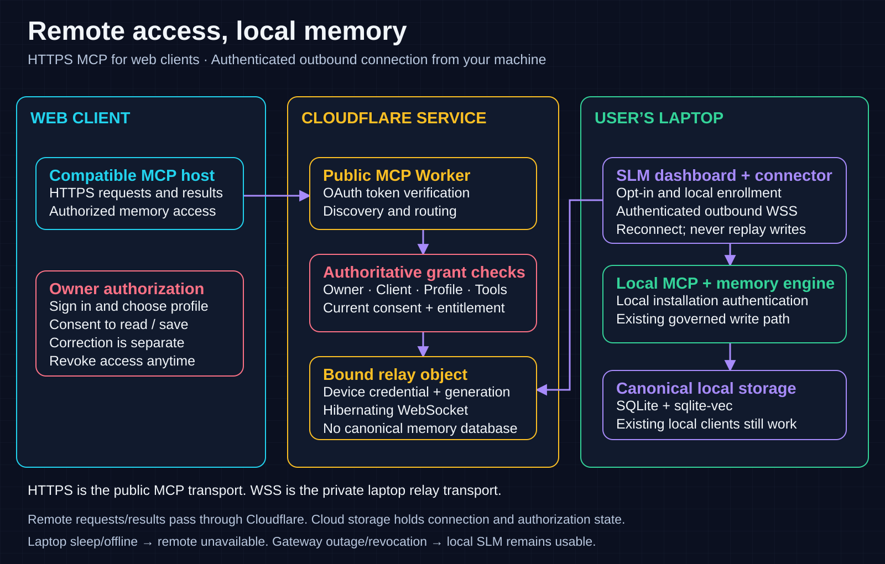

# Remote-access architecture

This architecture adds an optional authenticated web connection to [the existing local engine](../ARCHITECTURE.md).

## One canonical engine, two access paths

Local Claude Code, Codex, CLI, SDK and MCP clients keep their existing entry points and complete local capability set. Optional remote clients reach the existing loopback MCP entry point through a companion connector. Both paths use the same governed admission, write coordination and canonical database. The companion must not open a competing memory-database writer.

| Component | Responsibility | Boundary |
| --- | --- | --- |
| Existing dashboard | Initiate enrollment, display consent and verified state, disconnect | Local installation authentication; no cloud secrets in browser storage |
| Local enrollment service | Journal explicit opt-in and idempotent operations; load protected credentials; supervise the companion | Namespaced remote state; preserve existing local configuration |
| Companion connector | Establish authenticated outbound WSS; forward bounded admitted requests to a fixed loopback MCP URL | No caller-selected destination, redirects or unlimited buffering |
| Public MCP Worker | HTTPS MCP endpoint, token verification, discovery filtering and request routing | Authenticate each request before routing |
| Authorization service and registry | Bind owner, client, installation, profile, audience, original consent and current policy; enforce remote entitlement and revocation | Server authority; client/UI flags are not proof of permission |
| Durable Object relay | Retain binding/generation and correlated socket traffic, handle offline/timeout/revoke | Hibernating private relay; no canonical memory database |
| Existing SLM engine and storage | Memory tools, governed writes, recall, mesh and configured answer checks | Existing local permissions and canonical storage remain authoritative |

Cloudflare provides an [OAuth provider library for MCP authorization](https://developers.cloudflare.com/agents/model-context-protocol/protocol/authorization/). Public MCP uses HTTPS; WSS is our private outbound laptop transport. These are separate protocol boundaries, not a new public MCP protocol named "MCP 2.0".

## A remote call

1. The owner opts in from the existing dashboard and binds an installation/profile to a connection.
2. The AI client completes login and consent. Its grant has an immutable permission ceiling.
3. The gateway verifies the token, owner/client/audience binding, current grant state and remote entitlement. Effective permissions are the intersection of token scope, original consent and current connection policy.
4. The gateway validates the MCP request and limits tool discovery to permitted tools. Read-only consent does not authorize writes, corrections, arbitrary local tools or broader profile visibility.
5. The relay correlates the admitted request with the authenticated connector's current generation and deadline.
6. The companion forwards the original bounded MCP payload to the fixed loopback endpoint with local installation authentication. Cloud credentials never replace local installation credentials.
7. The local engine executes through its existing admission and write path. The response returns through the relay to the client.

Loss of a response is not proof a write failed. Reconnect must not automatically replay a possibly completed memory write. Durable idempotency belongs in the composed origin operation contract.

## Data and availability

The database remains local, but remote request and response contents traverse Cloudflare and the AI host. Production logging must exclude memory bodies, credentials and raw tokens. Cloud state contains identity/consent/connection records and operational metadata; protected credential material is governed separately. No hosted copy of the memory database is required.

Laptop sleep, loss of internet or a stopped companion produces remote unavailability. It must never be represented as a successful empty recall. Gateway or entitlement failures affect only remote access. Local SLM remains available independently.

There is no per-user Cloudflare account, named Tunnel, cloudflared process or DNS record. The provider manages shared endpoint hostnames; users operate the SLM dashboard. Hosted subscriptions are a future remote-service boundary, not a local-core paywall.

## Visual assets

The [integrated SVG](assets/slm-integrated-architecture.svg), [connection overview SVG](assets/slm-local-and-remote.svg), [mobile SVG](assets/slm-local-and-remote-mobile.svg) and [boundary SVG](assets/remote-gateway-boundaries.svg) are editable documentation source. PNG counterparts are rendered exports, not screenshots of a released service. Update diagrams when the architecture changes; verify the rendered assets against the [acceptance procedures](acceptance.md).
